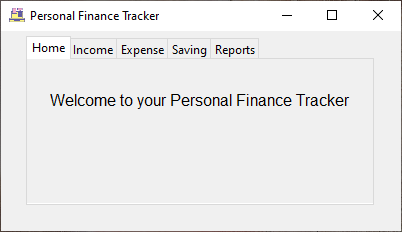
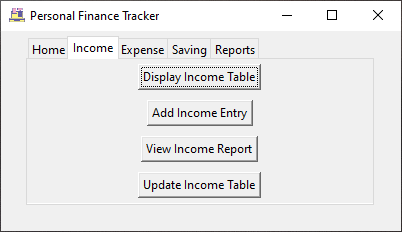
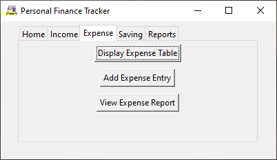
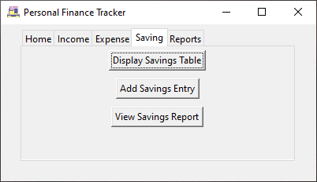
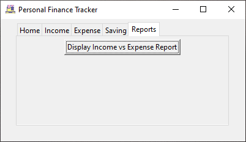
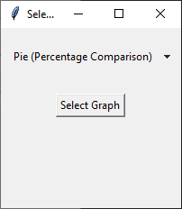
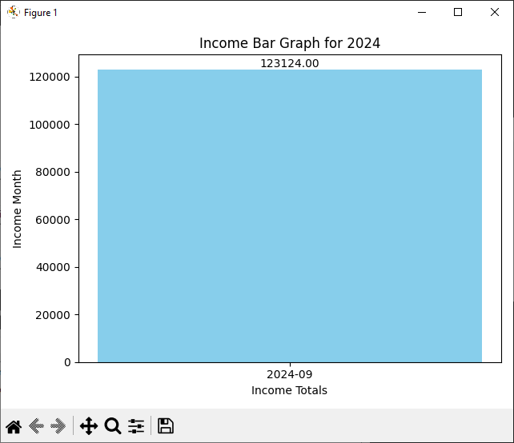
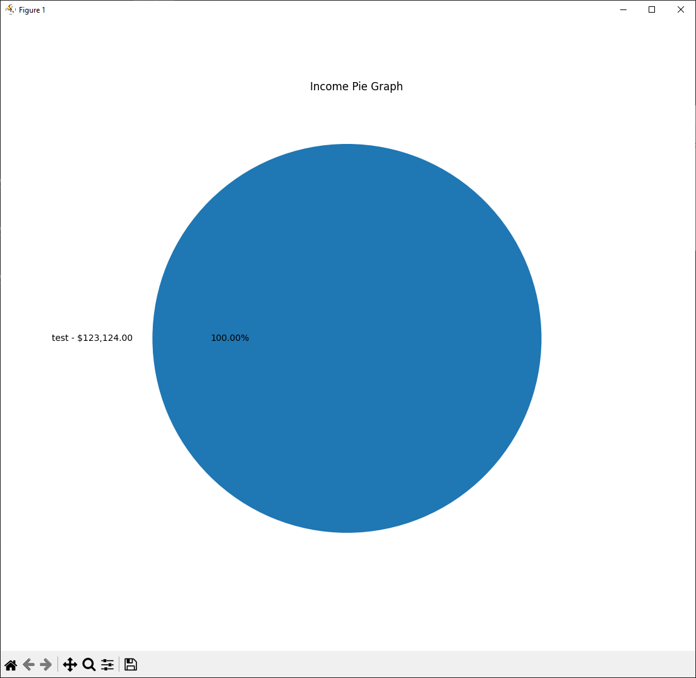
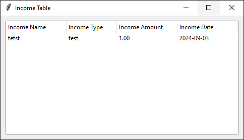
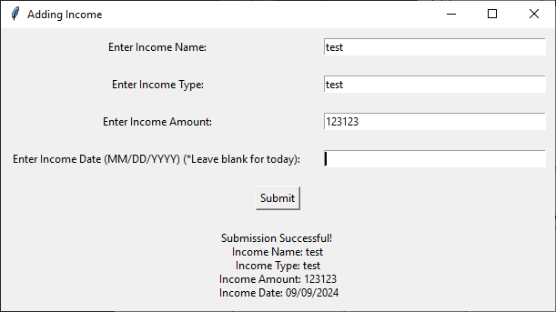

# Personal Finance Tracker

The Personal Finance Tracker is a Python application that allows users to track their income, expenses, and savings goals. It provides a user-friendly graphical interface (GUI) for data entry, stores data using PostgreSQL and PgAdmin, and generates visual reports using Matplotlib. The application helps users effectively manage their finances by offering tools for tracking income, expenses, savings progress, and budget adherence.

## Table of Contents
- [Getting Started](#getting-started)
    - [Prerequisites](#prerequisites)
    - [Installing](#installing)
    - [PostgreSQL Setup](#setting-up-postgresql-server)
- [GUI Interfaces](#gui-interfaces)
- [Running Tests](#running-the-tests)
- [Deployment](#deployment)
- [Built With](#built-with)
- [Versioning](#versioning)
- [Roadmap](#roadmap)
- [Author](#authors)
- [Acknowledgements](#acknowledgments)

## Getting Started

These instructions will guide you through the setup of the project and getting it up and running on your local machine for development and testing.

### Prerequisites

To set up this project, you will need the following:

```
- Python 3.x
- Tkinter (for the GUI)
- PostgreSQL and PgAdmin (for data storage)
- Matplotlib (for data visualization)
- Git and GitHub (or another version control system)
```

### Installing

A step-by-step guide to set up the development environment:
1. Install Python:
    - Download the latest version of Python form the official website.
    - Verify the installation by running the following command.
    ```css
    python --version
    ```

2. Install required libraries:

    Open terminal and install the necessary Python libraries:
    ```
    pip install tk matplotlib psycopg2-binary pandas prettytable 
    ```

3. Clone the repository:
    ```bash
    git clone https://github.com/ItsMotive/Personal-Finance_Tracker
    ```

4. Navigate to the project directory:
    ```bash
    cd your-project-directory
    ```

### Setting up PostgreSQL server
1. Install [PostgreSQL](https://www.postgresql.org/) and [PgAdmin](https://www.pgadmin.org/)
2. Open up [Database_Table_Creation_Script.py](/DB_Setup/Database_Table_Creation_Script.py) and update **initialSetup()** function with your information:
    ```
    connection = psycopg2.connect(
            dame=Your Database Name,
            user=Your Database Username,
            password=Your Database Password,
            host=Your Database Host,
            port=Your Database Port
        )
    ```
3. Run the file and every necessary database should be seen in PgAdmin

## GUI Interfaces

<table style="table-layout: fixed; width: 100%;">
    <tr>
        <td style="text-align: center; width: 20%;">
            
            <p style="font-size: 12px;">Main Window</p>
        </td>
        <td style="text-align: center; width: 20%;">
            
            <p style="font-size: 12px;">Main Income Window</p>
        </td>
        <td style="text-align: center; width: 20%;">
            
            <p style="font-size: 12px;">Main Expense Window</p>
        </td>
        <td style="text-align: center; width: 20%;">
            
            <p style="font-size: 12px;">Main Savings Window</p>
        </td>
        <td style="text-align: center; width: 20%;">
            
            <p style="font-size: 12px;">Main Reports Window</p>
        </td>
    </tr>
    <tr>
        <td style="text-align: center;">
            
            <p style="font-size: 12px;">Report Selection</p>
        </td>
        <td style="text-align: center;">
            
            <p style="font-size: 12px;">Bar Graph Example</p>
        </td>
        <td style="text-align: center;">
            
            <p style="font-size: 12px;">Pie Graph Example</p>
        </td>
        <td style="text-align: center;">
            
            <p style="font-size: 12px;">Income Table Example</p>
        </td>
        <td style="text-align: center;">
            
            <p style="font-size: 12px;">Entry Form Example</p>
        </td>
    </tr>
    <tr>
        <td style="text-align: center;">
            
            <p style="font-size: 12px;">Income vs Expense Graph Example</p>
        </td>
    </tr>
</table>

## Running the tests

**WIP**

### Break down into end to end tests

***WIP***

## Built With

* [Tkinter](https://docs.python.org/3/library/tkinter.html) - GUI Framework
* [PostgreSQL](https://www.postgresql.org/) - Database for storing financial data
* [PgAdmin](https://www.pgadmin.org/) - Visually see database
* [Matplotlib](https://matplotlib.org/) - Libraries for data visualization


## Versioning

I use Git for version control and GitHub for repository management. To view the history of changes or switch between versions, use Git commands like git log or explore the commits on this repository.

You can check out specific versions or releases by visiting the releases page on GitHub or by using Git tags and branches.

For example, to check out a specific version:
```php
git checkout <tag_name>
```

Or to view the latest changes:
```bash
git log
```

## Roadmap

This section outlines features and improvements that are currently being worked on or planned for future releases:

- **Upcoming Functionality Additions**:
    - **Savings Progress**: Users will be able to enter progress towards a specific savings goal
    - **Savings Goal Current Progress**: Users will be able to see current progress towards all goals
    - **Budgeting System**: Users will be able to set monthly budgets for different categories and receive alerts when exceeding them.
    - **Recurring Transactions**: Automatically log recurring income or expense transactions (e.g., rent, salary)
    - **Manual Data Entry**: Users will be able to add/modify entries manually through a text document
    - **Interest Calculator**: Users will be able to calculate future profits dependent on savings type (Compound, Simple, etc.)
- **Upcoming Improvements**: 
    - Restructuring the project for a more efficient and organized directory structure.
    - Addressing any redundancies in code and improving performance where necessary.
    - Fixing potential issues to ensure smooth user experience and functionality.

## Authors

* **Austin** - *Initial work* - [ItsMotive](https://github.com/itsmotive)

## Acknowledgments

* Thanks to open-source libraries like Tinter and Matplotlib.
* Inspiration from financial tracking applications.
